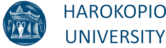
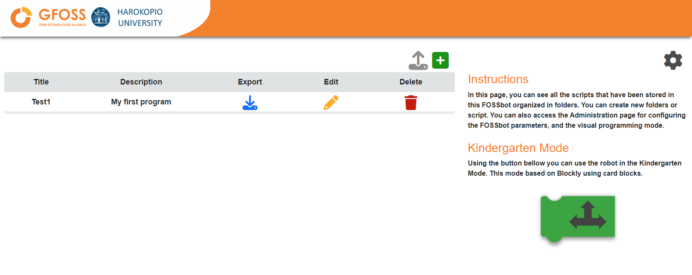
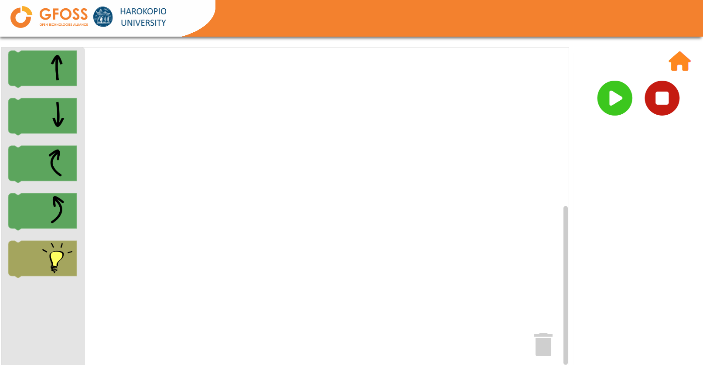
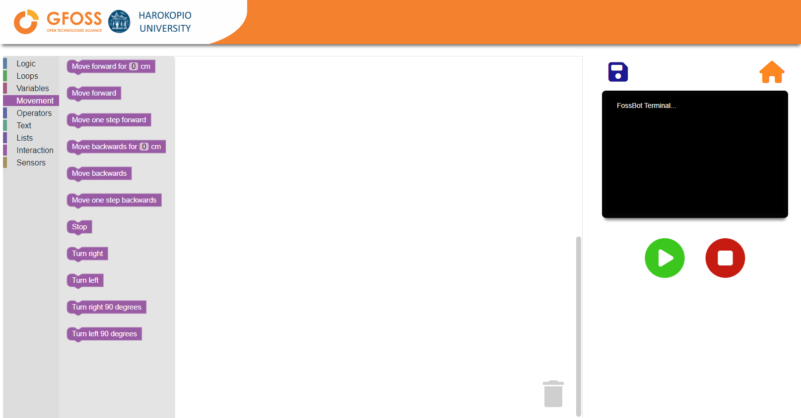

## Fossbot Platform

## General Information
The FOSSBot Platform is a open-source project combining a DIY educational robot with an open source online simulation environment made in Godot. Key features include an interactive online coding environment, even without the physical robot. The platform supports both a custom block-based visual editor and a Python IDE, utilizing modern technologies like PostgreSQL, Docker, React, and FastAPI for a seamless experience. It's designed to be lightweight and user-friendly, suitable for schools with limited internet resources. Future updates will introduce collaborative features and compatibility with devices like Arduino and MicroPython-enabled microcontrollers.

* React Front-end
* Python Back-end using FastAPI
* PostgreSQL
* Docker
* Godot FOSSBot Simulator
* WebGL and WASM

## Screenshots
### Blockly IDE

### Monaco (native Python) IDE

### Development
1. Start Websocket Server
2. Start the fornt-end server

### Usage

Soon...

## Software Development Team
* Christos Chronis
* Eleftheria Papageorgiou
* Dimitris Charitos
* Manousos Linardakis

