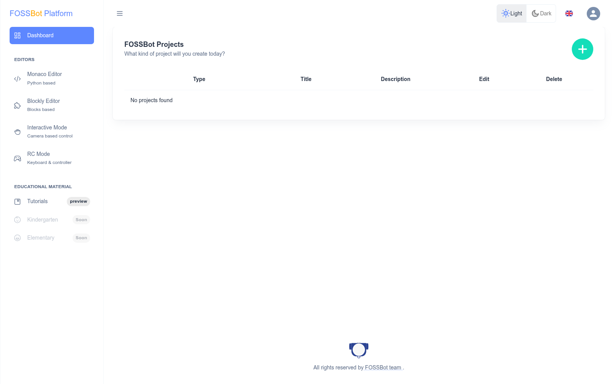
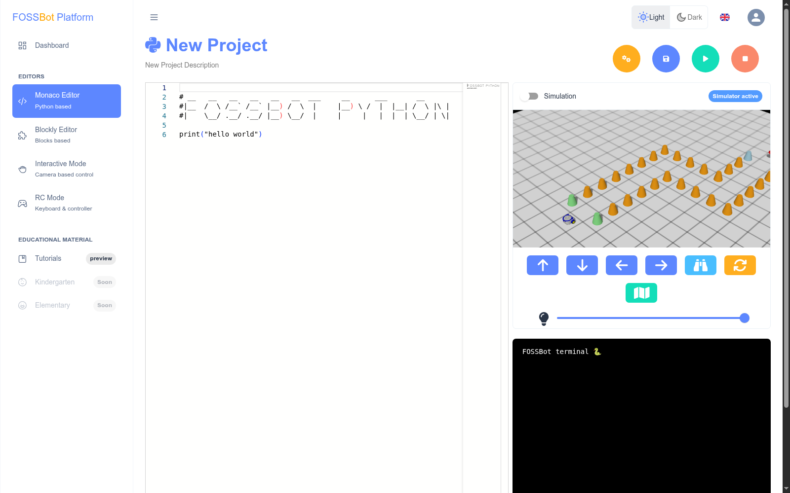
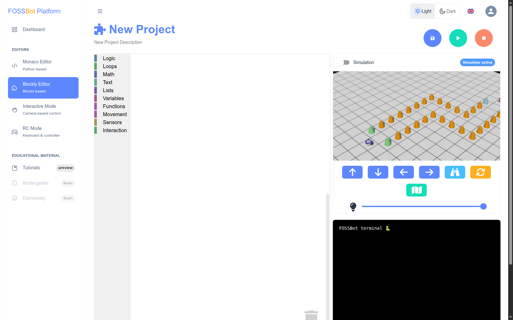
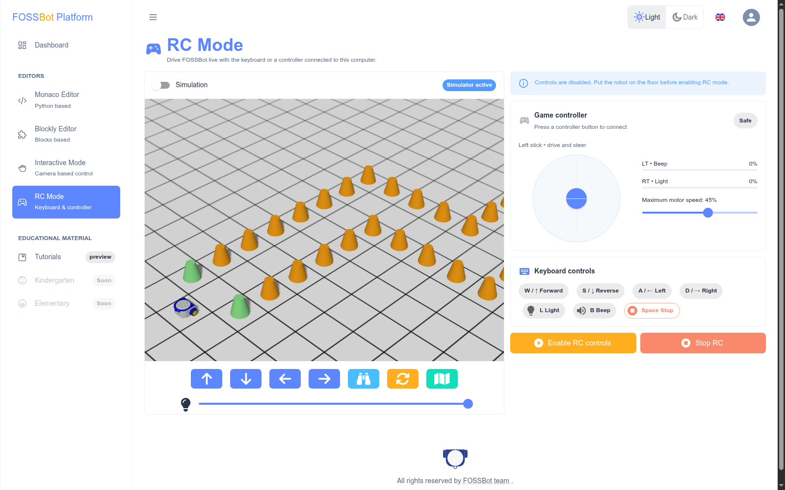
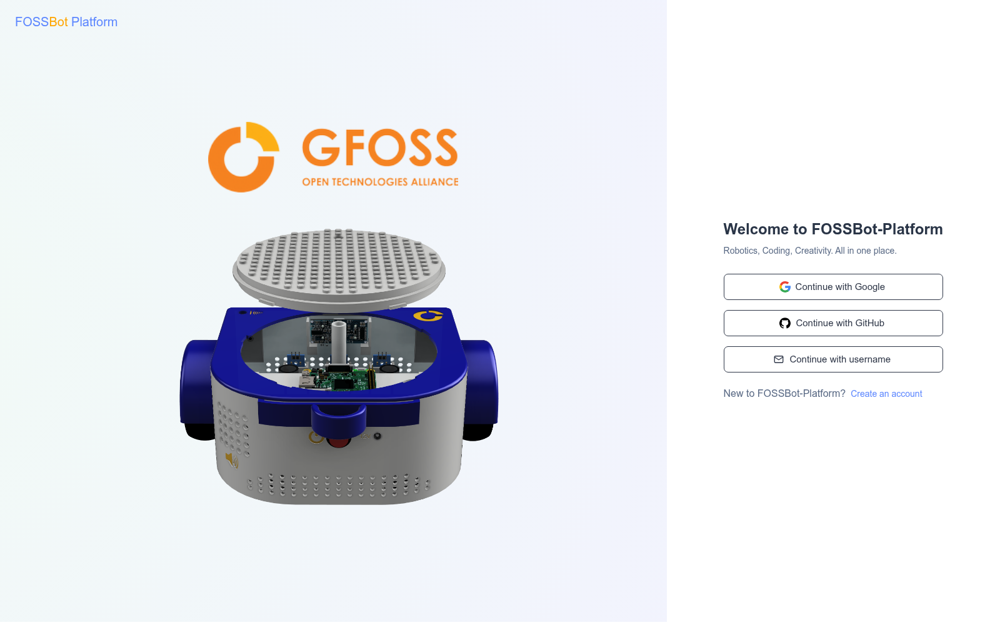

<p align="center">
  
</p>

# FOSSBot Platform

<p align="center">
  <strong>Learn programming by controlling a simulated or physical FOSSBot from the browser.</strong>
</p>

<p align="center">
  <a href="https://fossbot.gr">Open the platform</a> ·
  <a href="#quick-start">Run locally</a> ·
  <a href="#connect-a-physical-fossbot">Connect a robot</a>
</p>



## Overview

FOSSBot Platform is a browser-based educational programming environment for the FOSSBot robot. Learners can create projects with Python or visual blocks, experiment safely in a 3D simulator, and then run the same ideas on a physical robot connected to their local network.

The platform combines a React and TypeScript frontend, a FastAPI backend, PostgreSQL project storage, Firebase social authentication, and a Three.js simulation environment. When physical-robot mode is enabled, the browser connects directly to the FOSSBot agent; robot traffic does not need to pass through the platform server.

## Highlights

- Four programming experiences: Monaco, Blockly, Interactive, and RC mode.
- A browser-based 3D simulator for testing programs before using hardware.
- Direct control of a physical FOSSBot on the learner's local network.
- Live robot telemetry, including distance, floor, motion, light, battery, and wheel data.
- A terminal that displays the physical program's standard output and errors in real time.
- Keyboard and game-controller support for remote driving.
- Project persistence with local accounts or Google and GitHub sign-in.
- English and Greek interfaces, with light and dark themes.

## Programming modes

### Monaco

Write Python in a full code editor with syntax highlighting and an integrated terminal. Programs can run in the simulator or be sent to a connected physical robot.

### Blockly

Build programs visually by dragging blocks for movement, lights, sensors, sound, timing, and control flow. The generated program uses the same execution path as Monaco.

<table>
  <tr>
    <td width="50%"><br><sub>Python programming with Monaco</sub></td>
    <td width="50%"><br><sub>Visual programming with Blockly</sub></td>
  </tr>
</table>

### Interactive

Control movement, lights, and sound immediately without writing a complete program. Interactive mode also supports camera-based hand gestures when camera access is granted by the user.

### RC mode

Drive the robot for experimentation and play using the keyboard or a game controller. The left analogue stick controls movement and steering, while controller triggers operate the light and buzzer. A speed limit and prominent stop control help keep physical driving manageable.



## Simulation and physical robots

Every programming mode can switch between two targets:

- **Simulator:** executes inside the browser and visualizes the robot on a virtual stage.
- **Physical robot:** sends programs and interactive commands directly from the browser to a selected FOSSBot.

While a physical program is running, the platform displays live telemetry for the ultrasonic and perimeter distance sensors, floor sensors, accelerometer, gyroscope, ambient light, battery, power, and wheel odometers. Program output is streamed to the terminal so that `print()` messages and runtime errors appear where learners already expect them.

```text
                         ┌─ Three.js simulator
Browser ─ React frontend ┤
   │                     └─ Socket.IO ─ FOSSBot agent :8081
   │
   └─ HTTP API ─ FastAPI ─ PostgreSQL
```

## Connect a physical FOSSBot

1. Connect the computer or tablet and the FOSSBot to the same local network.
2. Open Monaco, Blockly, Interactive, or RC mode and switch from **Simulation** to **Physical robot**.
3. Discover the robot or enter its URL, for example `http://fossbot-000.local:8081` or `http://192.168.1.111:8081`.
4. Select the robot and connect. Keep the robot on the floor and within reach of its physical power control.

Chrome or another Chromium-based browser is recommended for direct local-network access. Depending on the browser and operating system, you may need to allow **Local network access** for the platform. This permission is separate from camera access. The FOSSBot agent must also accept the website origin—for example `https://fossbot.gr` in production or `http://localhost:3000` during local development.

## Accounts and projects

Users can sign in with a platform account, Google, or GitHub. Saved projects remain associated with the same user and can be reopened from the dashboard.



## Quick start

### Requirements

- Git
- Docker Engine with Docker Compose v2

### Start the development stack

```bash
git clone https://github.com/eellak/fossbot-platform.git
cd fossbot-platform
docker compose -f docker-compose-dev.yml up -d --build
```

Open:

- Platform: [http://localhost:3000](http://localhost:3000)
- API documentation: [http://localhost:8000/docs](http://localhost:8000/docs)

The default development account is `admin` with password `admin`. These credentials are intended only for a local development environment.

Follow the services while developing:

```bash
docker compose -f docker-compose-dev.yml logs -f frontend backend
```

Stop the stack without deleting the development database:

```bash
docker compose -f docker-compose-dev.yml down
```

Adding `-v` removes the local PostgreSQL volume and all projects stored in that development database.

## Optional social-login setup

Username and password login works without Firebase. To test Google or GitHub sign-in locally, create `front-end/.env.development.local` with your Firebase web-app configuration:

```dotenv
REACT_APP_FIREBASE_API_KEY=
REACT_APP_FIREBASE_AUTH_DOMAIN=
REACT_APP_FIREBASE_PROJECT_ID=
REACT_APP_FIREBASE_STORAGE_BUCKET=
REACT_APP_FIREBASE_MESSAGING_SENDER_ID=
REACT_APP_FIREBASE_APP_ID=
```

Create `back-end/.env.local` with the matching project ID:

```dotenv
FIREBASE_PROJECT_ID=
```

Both files are ignored by Git. Configure Google and GitHub as sign-in providers in Firebase Authentication, add `localhost` to the authorized domains, and restart the frontend and backend containers.

## Project structure

```text
fossbot-platform/
├── front-end/             React, TypeScript, editors, simulator, and robot UI
├── back-end/              FastAPI application, authentication, and project API
├── images/                Documentation and branding assets
├── nginx/                 Production reverse-proxy configuration
├── docker-compose-dev.yml Local development stack
└── docker-compose.yml     Production stack
```

## Production deployment

Production deployment is handled by the GitHub Actions workflow in `.github/workflows/deploy.yml`. The workflow builds the application, preserves the existing PostgreSQL volume, creates a database backup before migration, and verifies the deployed health endpoints. Deployment credentials and Firebase values belong in GitHub Actions secrets rather than tracked environment files.

## Troubleshooting

- **The app opens but the robot is not found:** confirm that the browser device and robot are on the same network, then try the robot's IP address instead of its `.local` hostname.
- **The browser cannot reach the robot:** check the browser's Local network access permission and use a Chromium-based browser if the current browser does not expose that capability.
- **“Not an accepted origin”:** add the exact platform origin to the FOSSBot agent's allowed origins; browser permission cannot override a rejection from the robot.
- **A login request returns HTML instead of JSON:** verify that the backend is running and reachable at [http://localhost:8000/docs](http://localhost:8000/docs).

## Project partners

<p>
  
  &nbsp;&nbsp;&nbsp;
  
</p>
