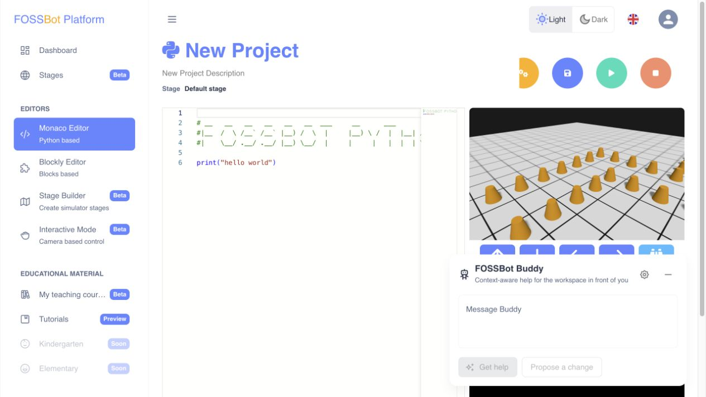

# FOSSBot Buddy

FOSSBot Buddy gives context-aware explanations and reviewable suggestions in the Python, Blockly, lesson, and Stage Builder workspaces. It never applies, saves, publishes, grades, or changes progress by itself. AI access is disabled and denied by default.



## Connect a local model

At the time of writing (2026-08-10), start with **Qwen3.6 27B** or the faster **Qwen3.6 35B-A3B** if your hardware can run it.

1. Start an OpenAI-compatible server. For Ollama, pull and run `qwen3.6:27b` or `qwen3.6:35b-a3b`; see the [Ollama model page](https://ollama.com/library/qwen3.6) and [OpenAI-compatible API guide](https://docs.ollama.com/api/openai-compatibility).
2. For llama.cpp, download a suitable Qwen3.6 GGUF and start the server:

   ```bash
   llama-server -m /path/to/qwen3.6.gguf --alias qwen3.6 --host 127.0.0.1 --port 8080 -c 32768
   ```

   See the [llama.cpp server guide](https://github.com/ggml-org/llama.cpp/blob/master/tools/server/README.md) for installation, model loading, GPU, context, CORS, and network options.
3. In **Administration → AI assistant**, add an **OpenAI-compatible** provider. Choose **User local**, the matching compatibility profile, and the exact model name. Enable the provider and instance, make it the default, and add explicit allow rules for the required roles, groups, users, and capabilities.
4. In **Buddy settings**, enter `http://localhost:11434/v1` for Ollama or `http://localhost:8080/v1` for llama.cpp, enter the same model name, then save and test.

For one shared server, choose the **Hosted** runtime instead. Its base URL must be reachable from the backend; enable private-network access only for a trusted local endpoint. If the backend runs in Docker, `localhost` means the backend container—not the host machine.

## Detailed guides

- [Administrator guide](ai-assistant-admin-guide.md) — providers, policies, limits, rollout, and troubleshooting
- [Developer guide](ai-assistant-developer-guide.md) — architecture, contracts, providers, capabilities, and testing
- [Student guide](ai-assistant-student-guide.md) — safe use, previews, undo, and reporting problems
- [Teacher guide](ai-assistant-teacher-guide.md) — lesson, code, and Stage Builder review workflows
